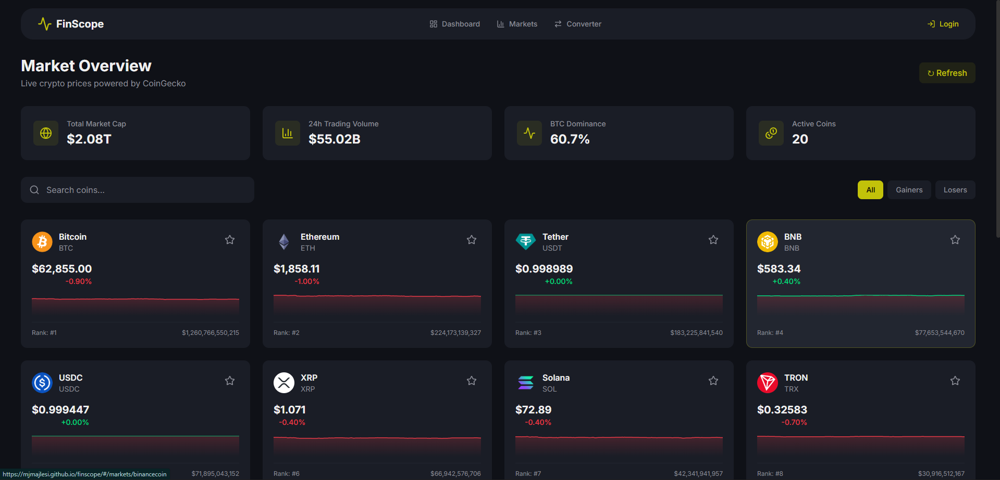
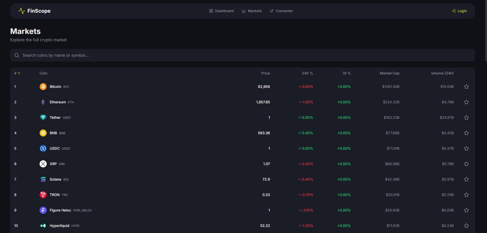
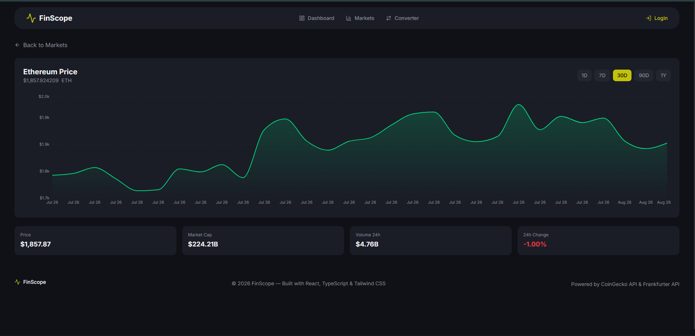

<div align="center">

# 📊 FinScope

**Financial Market Dashboard & Currency Converter**

A modern, real-time cryptocurrency dashboard built with React, TypeScript, and Tailwind CSS.
Track live prices, analyze charts, convert currencies, and build your personal watchlist.

[](https://mjmajlesi.github.io/finscope/)
[](https://react.dev)
[](https://www.typescriptlang.org)
[](https://vite.dev)
[](https://tailwindcss.com)

</div>

---

## ✨ Features

| Feature | Description |
|---------|-------------|
| 🏠 **Dashboard** | Real-time top 20 crypto prices, market stats, search & filters |
| 📈 **Markets** | Interactive line charts, sortable market table, coin detail pages |
| 💱 **Converter** | Fiat & crypto conversion with 40+ currencies |
| ⭐ **Watchlist** | Star-based coin tracking with persistent localStorage |
| 🔐 **Authentication** | Login/logout with protected watchlist route |
| 📱 **Responsive** | Mobile-first design, works beautifully on all devices |
| 🎨 **Dark Theme** | Modern dark UI with copper accent color |

## 🚀 Quick Start

```bash
# Clone the repository
git clone https://github.com/mjmajlesi/finscope.git
cd finscope

# Install dependencies
npm install

# Start development server
npm run dev

# Build for production
npm run build

# Preview production build
npm run preview
```

## 📁 Project Structure

```
finscope/
├── src/
│   ├── api/              # API clients & mock data
│   │   ├── coingecko.ts  # CoinGecko + Frankfurter API
│   │   └── mockData.ts   # Fallback data for offline use
│   ├── components/       # Reusable UI components
│   │   ├── MarketChart.tsx
│   │   ├── MarketTable.tsx
│   │   ├── CurrencyConverter.tsx
│   │   └── ...
│   ├── context/          # React Context providers
│   │   ├── AuthContext.tsx
│   │   └── WatchlistContext.tsx
│   ├── hooks/            # Custom React hooks
│   ├── pages/            # Route-level components
│   │   ├── Dashboard.tsx
│   │   ├── Markets.tsx
│   │   ├── Converter.tsx
│   │   ├── Watchlist.tsx
│   │   └── Login.tsx
│   ├── types/            # TypeScript definitions
│   ├── App.tsx           # Root component with routing
│   └── main.tsx          # Entry point
├── .github/workflows/    # GitHub Actions deployment
└── package.json
```

## 🎨 Theme

The app uses a custom dark theme with CSS variables:

| Variable | Color | Usage |
|----------|-------|-------|
| `--color-brand` | `#C2C20A` | Copper/gold accent |
| `--color-bg-main` | `#0F1117` | Main background |
| `--color-bg-card` | `#1A1D26` | Card backgrounds |
| `--color-status-up` | `#16C784` | Positive/green |
| `--color-status-down` | `#EA3943` | Negative/red |

## 📊 API Integration

**Free APIs, no keys required:**

- **[CoinGecko API](https://www.coingecko.com/en/api)** — Live crypto prices, charts, market data
- **[Frankfurter API](https://api.frankfurter.app)** — Real-time exchange rates

The app gracefully falls back to mock data if APIs are unavailable (e.g., geo-restrictions).

## 🌐 Live Demo

**[https://mjmajlesi.github.io/finscope/](https://mjmajlesi.github.io/finscope/)**

## 📸 Screenshots

> Dashboard with live prices and sparkline charts



> Markets page with interactive line chart and sortable table



> Chart view with coin details and historical price graph




## 🛠 Tech Stack

- **React 19** — Latest React with concurrent features
- **TypeScript 5** — End-to-end type safety
- **Vite 7** — Lightning-fast build tool
- **Tailwind CSS 4** — Utility-first styling with custom theme
- **Recharts** — Beautiful, responsive charts
- **Lucide React** — Clean, consistent icons
- **React Router 7** — Client-side routing with HashRouter